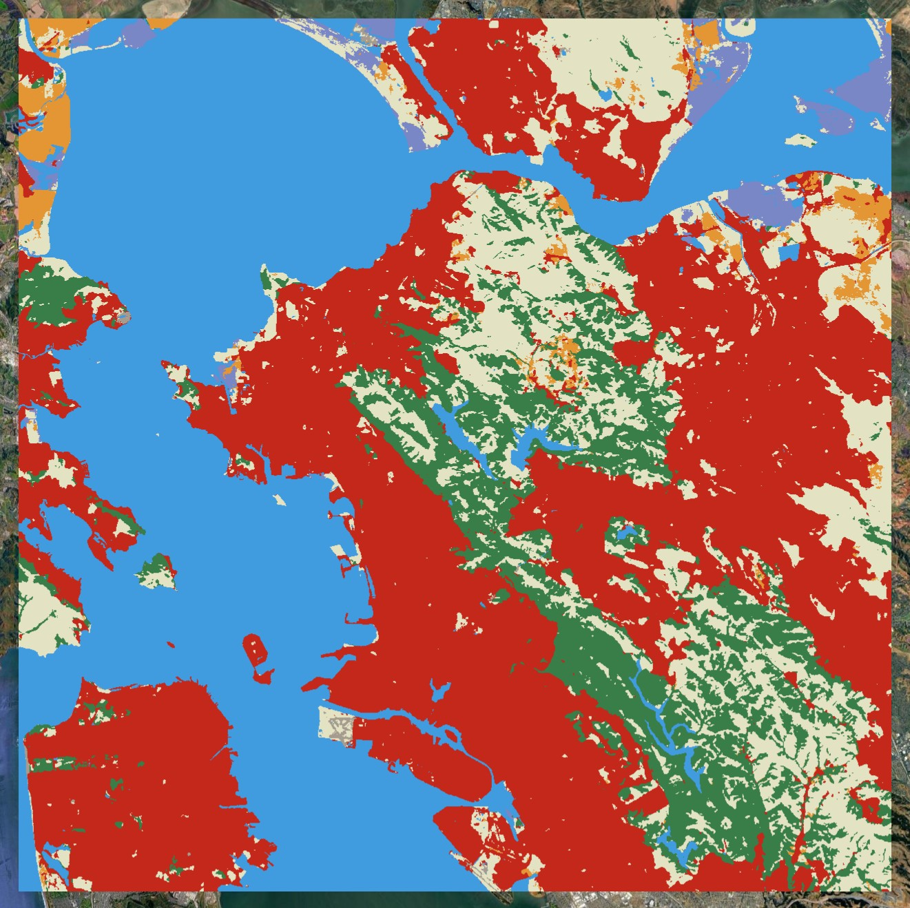
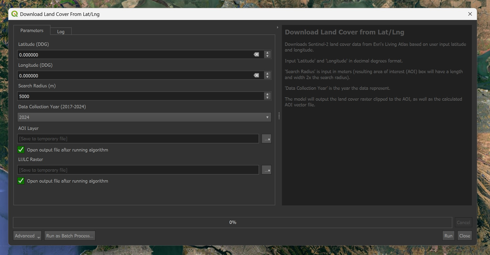
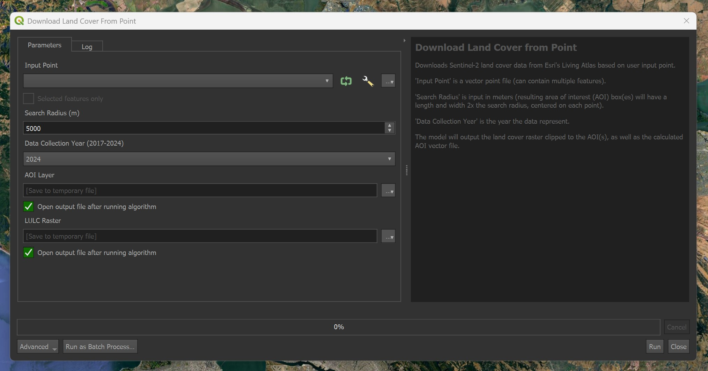
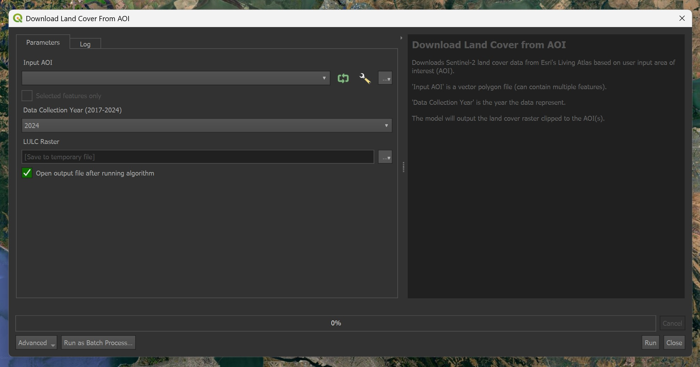

# Land Cover Downloader

***Land Cover Downloader*** allows users to quickly download Sentinel-2 land cover data from Esri's Living Atlas.  Using a user-defined point or area of interest (AOI), this model automatically downloads and clips land cover data from a specified year.

## Basic Structure

The basic structure of ***Land Cover Downloader*** is discussed below, to include the model parameters, data sources, and methodology.

### Parameters

***Land Cover Downloader*** uses input location data (coordinate, point(s), or AOI(s)) and data year to find and download necessary data.

* ***Location/Search Area -*** The desired location/search area can be defined a few different ways, either with  latitude/longitude, a point vector file, or a polygon (AOI) vector file:
  * Latitude/Longitude - In decimal degrees (DDG) format. Must also specify a search radius. *The resulting search area length and width will be 2x the search radius*
  * Point(s) - A vector point file. File can have multiple features. Must also specify a search radius. *The resulting search area length and width will be 2x the search radius*
  * AOI(s) - A vector polygon file.  File can have multiple features.

 * ***Data Year -*** What year the data represent. Currently, Esri has published data from 2017-2024.

### Outputs

Each model outputs the clipped land cover raster as either a temporary file or saved to a file destination. Additionally, the latitude/longitude and point models also output the AOI used to download/clip the data as a separate vector file.

### Data Sources

***Land Cover Data -*** Land cover data from ESRI's Living Atlas project are used. These data come from the [Sentinel-2 10-Meter Land Use/Land Cover](https://livingatlas.arcgis.com/landcover/) dataset that is generated using AI classification and is updated annually.

### Methodology

* **1. Initial Setup -** The model takes the user input and, if necessary, generates an AOI based on the input latitude/longitude coordinate or point file.

* **2. Download the Data -** The model takes the AOI and determines which land cover tile data intersect it.  It then automatically downloads these data.

* **3. Mosaic and Clip the Data -** Since the land cover data are normally larger than the AOI and may be multiple separate tiles, these are be clipped and mosaiced to the final AOI size.

## Using the Included Tools

The included tools in the ***Land Cover Downloader*** toolbox all do essentially the same thing but take different inputs to determine the AOI.

###  Download Land Cover from Latitude/Longitude

This tool downloads data based on a user-defined point (latitude/longitude) and search area.

* ***Latitude*** and ***longitude*** values should be in decimal degrees (DDG) format using +/- to denote N/S or E/W.
* ***Search Radius*** defines the radius of the generated AOI in meters.
* ***Data Collection Year (2014-2017)*** defines the year the data represent (range: 2014-2024).

###  Download Land Cover from Point

This tool downloads data based on a user-defined point (vector file) and search area.

* ***Input Point*** can be in any vector point format.
* ***Search Radius*** defines the radius of the generated AOI in meters.
* ***Data Collection Year (2014-2017)*** defines the year the data represent (range: 2014-2024).

###  Download Land Cover from AOI

This tool downloads data based on a user-defined AOI (vector file).

* ***Input AOI*** can be in any vector polygon format.
* ***Data Collection Year (2014-2017)*** defines the year the data represent (range: 2014-2024).
